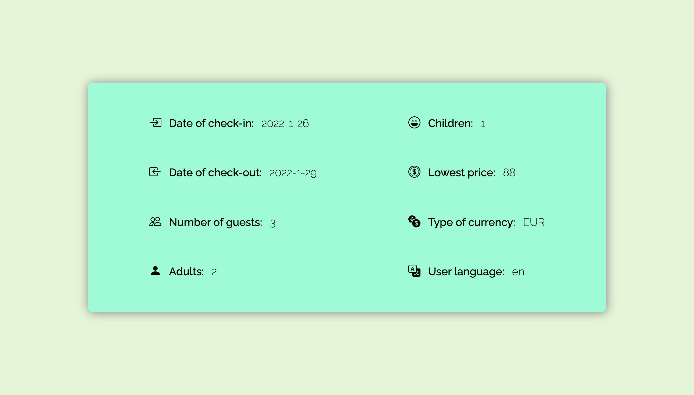

# Hotel Web Scrapper

    

### Description
This is a program that allows you to get specific information of your book request for a specific hotel (web scrapping). I have coded it using vanilla javascript, node.js and puppeeter.

### Technologies
It has been coded with vanilla javascript, using node.js as server and puppeter in order to create a headless browser (chromium) where to execute the program. On the other hand, it has been the first time I have used puppeteer, which -I confess- have given me more than one headache during the las three days.

A simple view template, created with HTML and CSS, has been enabled for better visualisation of captured data. It reads the data from a json file which in turn has been created from the scrapped data in the controller (StoreController.js)

### Challenges

#### From Spaghetti to OOP
Besides the struggle I experienced the first two days while I was getting used to puppeteer syntax and logic, the real challenge was yet to come later. Once I succeeded in making the desired request to scrap de webpage, I was facing a monstruous and incomprehensible code. 

Keeping in mind that we write code, firstly and before anything, for other humans, it was clear that something had to be done. I am quite a fan of Object Oriented Programming paradigm, since it allows to apply SOLID principles in an easier way, and also to make a more testeable and maintainable code.

This task took me two more days to accomplish it. But the result was worth the effort. 

I have not removed the first spaghetti version of my code, so that you can compare both of them. "Room237.js" is the one you should avoid, "BookService.js" and "StoreControler.js" are the OOP version, much more comprehensible, readable and testable.

